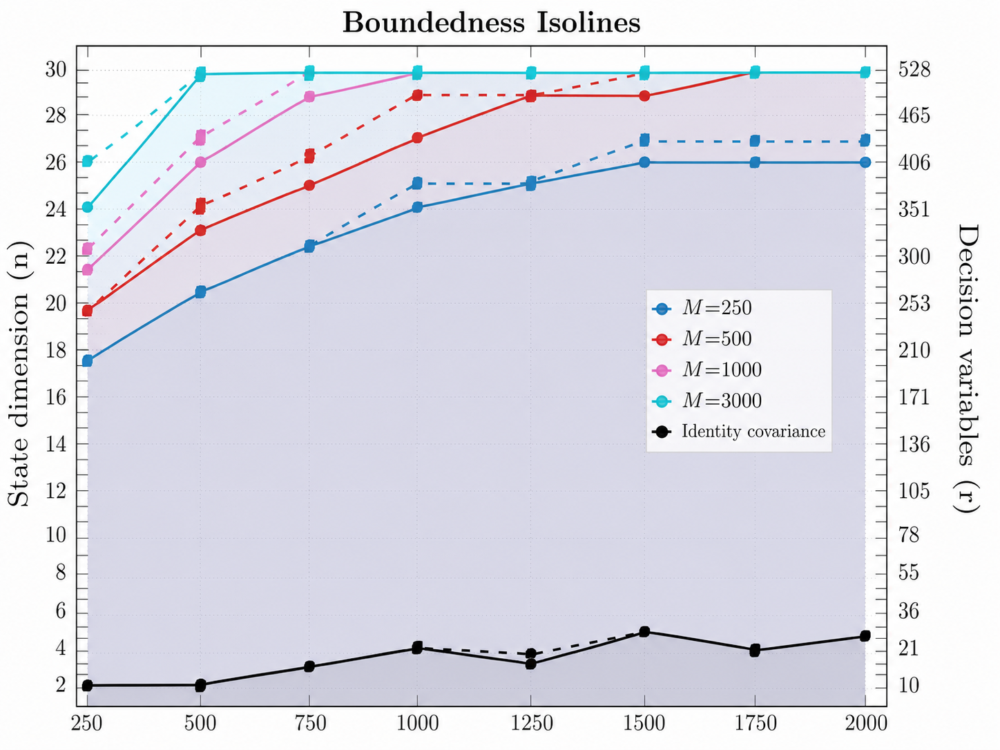
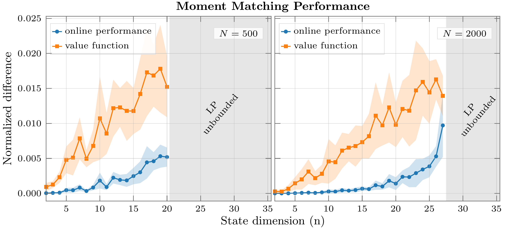
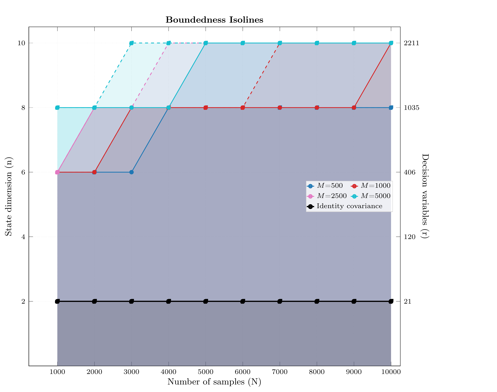
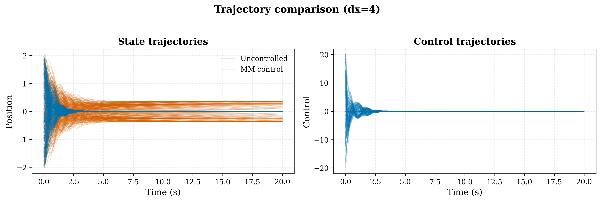
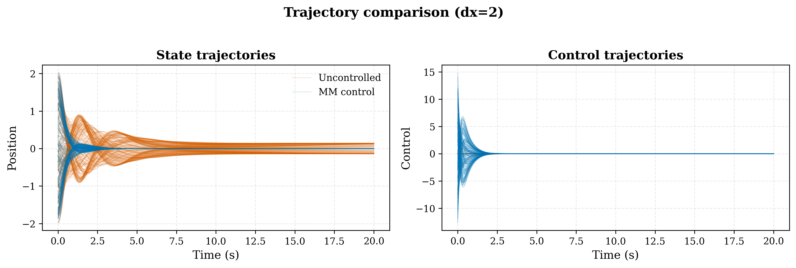
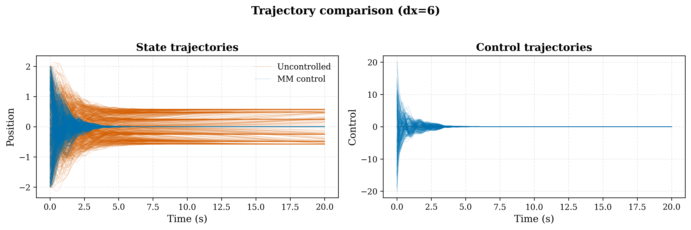
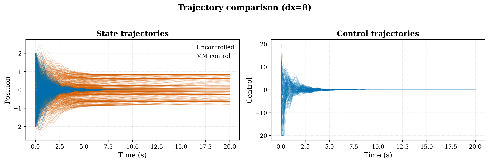
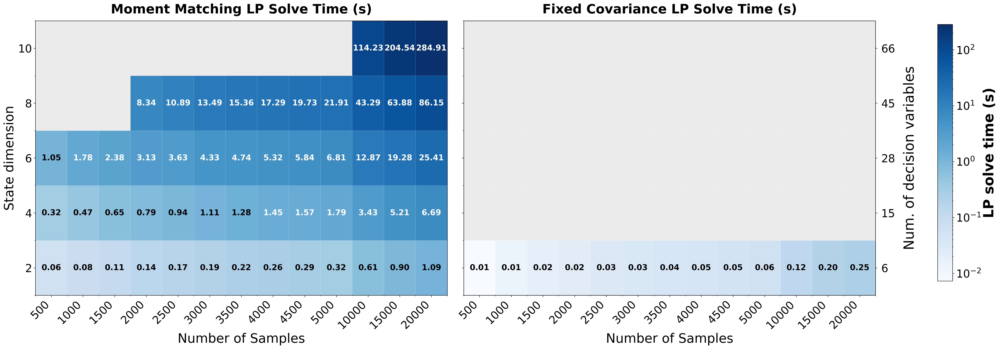

# Boundedness of Linear Programs for Data-Driven Optimal Control via Moment-Matching

This repository contains the reference implementation for the paper "Boundedness of Linear Programs for Data-Driven Optimal Control via Moment-Matching" by Andrea Martinelli, Lucia Pezzetti, Niklas Schmid, Florian Dörfler and John Lygeros.

## Requirements
Use Python 3.10 or above and install requirements by running

```
pip install -r requirements.txt
```
The experiments in this repository use Mosek (https://www.mosek.com) as the primary linear programming (LP) solver for the one-shot LP formulation. While other solvers (e.g., HiGHS or Gurobi) may work in principle, all results reported in the paper were obtained using Mosek. For full reproducibility, especially regarding numerical stability and solve times, we therefore strongly recommend using the same solver. Mosek requires a valid license, researchers affiliated with a university can obtain a free academic license:
1. Create an account at https://www.mosek.com/products/academic-licenses
2. Register using your institutional email address.
3. Request an Academic License.
4. Download the license file (`mosek.lic`).
5. Place `mosec.lic` in
   - Linux/macOS: ```~/mosek/mosek.lic```
   - Windows: ```C:\Users\<username>\mosek\mosek.lic```

# LTI systems
The `data/dx_*_du_2_systems.json` files store controllable LTI systems with increasing state dimension and 2 inputs according to $x_{k+1} = Ax_k + Bu_k$, where $A \in \mathbb{R}^{n \times n}$, $B \in \mathbb{R}^{n \times 2}$, and $n \in \{2, \dots, 30\}$. The diagonal entries of $A$ are fixed to $A_{ii} = 0.5$, while all off-diagonal elements of $A$ and $B$ are drawn in an Erdős–Rényi fashion:

$$
A_{ij}, B_{ij} \sim
\begin{cases}
0, & \text{with prob. } 0.1, \\
\mathcal{U}([-0.1, 0.1]), & \text{with prob. } 0.9.
\end{cases}
$$

The dataset of $N$ state-action samples is sampled from $\mathcal{U}([-0.5, 0.5]^{n}\times[-3.0,3.0]^2)$ and the corresponding next states and stage costs are computed. An auxiliary pool of $M=250, 500,1000,3000$ samples, drawn from the same distribution, is used to construct the covariance surrogate in the *moment-matching* formulation and quadratic polynomial features $\phi(x,u)$ have been used.

To reproduce the results in the paper run 

```
./run_bounded_lp_vs_dim_linear.sh
```

## Results
The obtained results are reported in the following plots

<table align="center">
  <tr>
    <td align="center">
        
    </td>
    <td align="center">
        
    </td>
  </tr>
</table>

Left: the plot reports boundedness isolines as a function of the number of samples $N$, the auxiliary pool size $M$, and the state dimension $n$. Solid lines mark the largest dimension with 100% boundedness across 10 random systems, while dashed lines mark the corresponding 50% threshold. The colored curves correspond to the proposed moment-matching formulation for different values of $M$; the black curve reports the fixed-covariance baseline. Larger $M$ Larger $M$ gives a richer auxiliary representation in equation (6), making the *moment-matching* equality easier to satisfy and hence improving boundedness. Conversely, the fixed objective baseline remains bounded only in low dimension. The baseline uses as measure $c$ a standard Gaussian distribution, since we are using quadratic polynomial features, this is equivalent to using as direction of the LP a fixed identity covariance structure, $\int_{\mathbf{Z}} \phi (z) c(dz) = \text{vec}(I)$.

Right: the normalized difference between the optimal value function and the *online performance* of the greedy policy (*i.e.*, the cost generated by the greedy policy associated to the solution of the LP) for $N=500$ (left) and $N=2000$ (right). For each state dimension, solid lines indicate the mean normalized error across random seeds, and shaded regions denote the standard deviation range. 
The normalized differences represent a sample-average Monte Carlo estimate of normalized cost/value gaps. Specifically, we sample initial states $x_0^{(i)} \sim \mathcal{U}([-0.5, 0.5]^{n})$, with $i = 1, \dots, d$ and $d = 100*n$. Both controllers (LQR and MM) are simulated from the same initial states, with control clipping $u_t \in [-3.0,3.0]^2$ and early stop when $||x_t|| < 10^{-3}$. Denote by $J_{MM}(x_0^{(i)})$ and $J_{LQR}(x_0^{(i)})$ the discounted infinite-horizon return (cost-to-go) under the MM policy and the LQR policy, respectively. The per-state normalized policy cost difference is defined as

$$
\delta_J(x_0^{(i)}) = \frac{J_{MM}(x_0^{(i)}) - J_{LQR}(x_0^{(i)})}{J_{LQR}(x_0^{(i)}) + 10^{-8}}, \quad i = 1, \dots, d.
$$

The values for which the rollouts converge are then averaged over the sampled initial states.

Similarly, for the same set of initial states we compute the normalized difference between the corresponding value functions. Let $V_{MM}(x_0^{(i)}) = (x_0^{(i)})^T P_{MM} x_0^{(i)}, \quad P_{MM} = Q_{xx} - Q_{xu}Q_{uu}^{-1}Q_{xu}^T$ and $V_{LQR}(x_0^{(i)}) = (x_0^{(i)})^T P_{LQR} x_0^{(i)}$. The normalized value difference is defined as

$$
\delta_V(x_0^{(i)}) = \frac{V_{MM}(x_0^{(i)}) - V_{LQR}(x_0^{(i)})}{V_{LQR}(x_0^{(i)}) + 10^{-8}}, \quad i = 1, \dots, d.
$$

The obtained set of $\delta_V(x_0^{(i)})$ is then averaged over the initial states.

# Mechanical system with cubic damping

We further investigate the proposed method on a class of nonlinear control systems given by an $n$-dimensional point-mass model with modal spring coupling and cubic drag.
The continuous-time dynamics are

$$
\begin{aligned}
\dot{p} &= v, \\
m \dot{v} &= - K p + G \tanh p -(\beta \|v\|^2 + \xi) v + B u.
\end{aligned}
$$

where $m$ is the mass, $\beta>0$ is the cubic-drag coefficient, $\xi=5$ is the viscous damping coefficient, $u \in \mathbb{R}$ is a scalar control input, and the state $x = [p \; v]^T \in \mathbb{R}^n$ collects positions and velocities.
The stiffness matrix $K \in \mathbb{R}^{n \times n}$ is of the form $K = Q \Lambda Q^T$ with $Q$ orthogonal and diagonal spectrum $\Lambda = \mathrm{diag}(\lambda_1,\dots,\lambda_n)$.
The eigenvalues follow a power-law growth

$$
    \lambda_i = k_0 i^{\alpha}, \quad i = 1, \dots, n,
$$

which yields increasingly fast and stiff high-frequency modes as the dimension grows. The base stiffness is set so that the highest modal natural frequency equals a target $\omega_{\max}$:

$$
  k_0 = \frac{m\,\omega_{\max}^{2}}{n^{\alpha}},
  \qquad \omega_{\max} = 5\;\text{rad/s}.
$$

The gravity term is componentwise and uses $G = (\lambda_{\min}(K) + 1)I$ by default, which makes the linearization around the origin locally unstable while keeping the nonlinearity bounded through $\tanh(p)$. In particular, the origin remains an equilibrium, but it is not a passive attracting equilibrium of the uncontrolled dynamics. Depending on the sampled modal coupling, the tanh gravity term can also induce additional off-origin equilibria. (Representative trajectories for different state dimensions $n$ are presented below). 

The input matrix $B \in \mathbb{R}^{n \times 1}$ is chosen as a normalized dense random vector, meaning that the single scalar actuator applies force in a generic direction that influences all coordinates, while keeping the overall input magnitude independent of the state dimension.

To study variability across problem instances, we randomise the system parameters across experimental seeds. The physical parameters are drawn from log-normal distributions centred at their nominal values:

$$
\begin{aligned}
   m &\sim \mathrm{LogNormal}(\bar{m},\, \sigma_m), \\
   c &\sim \mathrm{LogNormal}(\bar{c},\, \sigma_c).
\end{aligned}
$$

with nominal values $\bar m = 5.0$\,kg, $\bar c = 0.5Ns^{2}/m^{2}$, and scale parameters $\sigma_m = 0.3$, $\sigma_c = 0.5$ (corresponding to coefficients of variation of approximately $30\%$ and $50\%$, respectively).
The modal parameters are also randomised per seed:

$$
\begin{aligned}
   Q \sim \mathrm{Haar}\bigl(O(n)\bigr) \quad \text{(uniform random orthogonal basis)}, \\
   \alpha \sim \mathrm{Uniform}(1.8, 2.2) \quad \text{(modal growth exponent)}.
\end{aligned}
$$

The datasets of $N$ state-action pairs and of $M=500,1000,2500,5000$ auxiliary samples is randomly drawn accordingly to $x \in [-8, 8]^{n}, u \in [-20, 20]$. The discrete-time samples are generated with RK4 integration. The stage cost is quadratic in state and input: $\ell(x,u)=\|x\|^2+0.01\|u\|^2+\sum_i p_i^4$z. Polynomial features $\phi(x, u)$ with degree 4 in $x$, and $2$ in $u$ are used.

To reproduce the results in the paper run

```
./run_bounded_lp_vs_dim_nonlinear.sh
```

## Results
The obtained results are reported in the following plots

<table align="center">
  <tr>
    <td align="center">
      
    </td>
    <td align="center">
      
    </td>
  </tr>
</table>

Left: Empiricalthe plot reports boundedness isolines as a function of the number of samples $N$, the auxiliary pool size $M$, and the state dimension $n$. Solid lines mark the largest dimension with 100% boundedness across 10 random systems, while dashed lines mark the corresponding 50% threshold. The colored curves correspond to the proposed moment-matching formulation for different values of $M$; the black curve reports the fixed-covariance baseline.

Right: Representative closed-loop trajectories for $n=4$, $N = 2000, M =1000, $m=5kg, w_{max} = 5 rad/s$ and cubic drag coefficient $\beta = 0.5 Ns^2/m^2$. the *moment-matching* (MM) controller steers the system to the unstable equilibrium at the origin, while the uncontrolled trajectories are attracted by other stable equilibria.

<table align="center">
  <tr>
    <td align="center">
      
    </td>
    <td align="center">
      
    </td>
    <td align="center">
      
    </td>
  </tr>
</table>
Representative closed-loop trajectories for $n=2$, $n=6$ and $n=8$. 

### Computational Remarks
The baseline approach requires solving only the LP (6) but often results in unbounded problems. The proposed moment-matching LP adds the cost of solving equation (11), but substantially enlarges the regime in which the LP admits a finite solution. For the tested dimensions, this preprocessing overhead is moderate compared to the benefit of guaranteed boundedness. The following image reports, as an example, the averaged solving times across the bounded instances for M=250 in the linear case and M=500 in the nonlinear one. We note that the implementation could likely be further optimized, potentially leading to reduced computation times.

<p align="center">
  
</p>


# References and Contacts
Please reach out to lpezzetti@ethz.ch for any question about the code.
